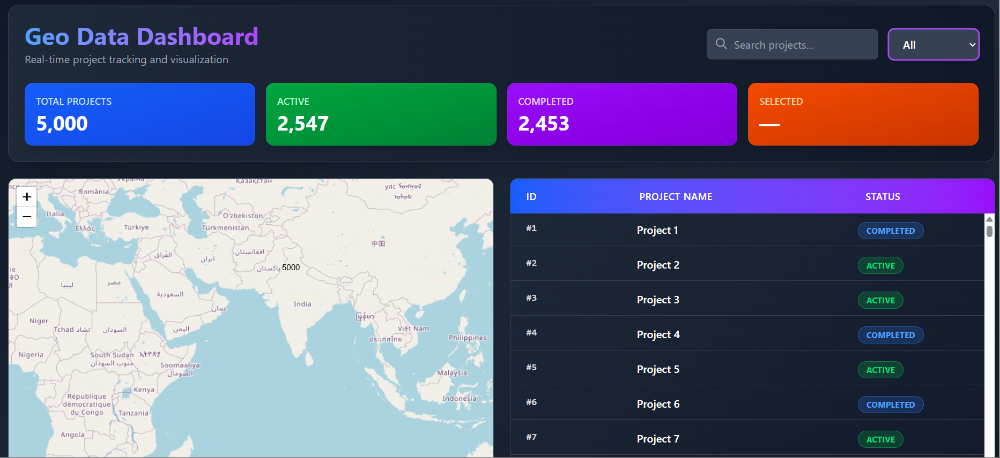
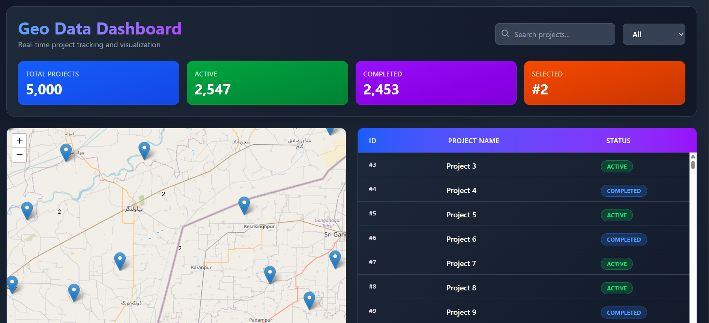
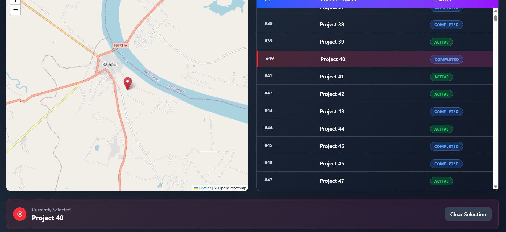
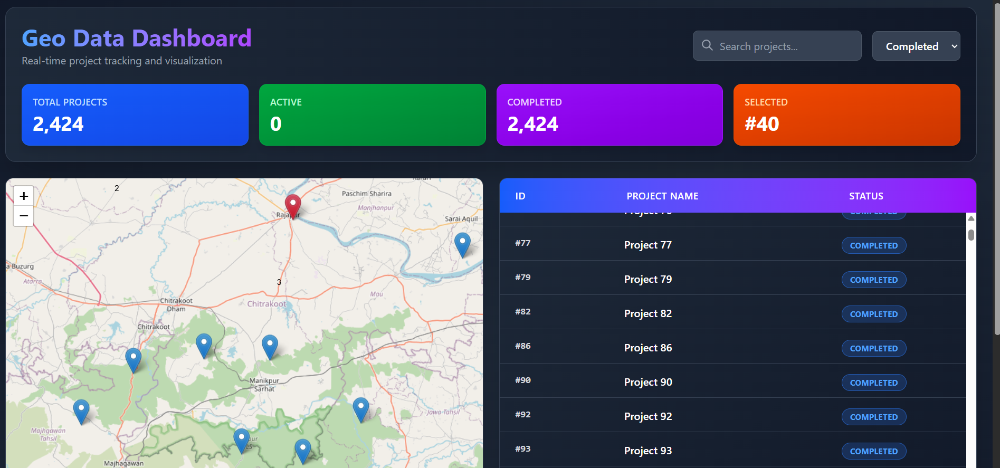
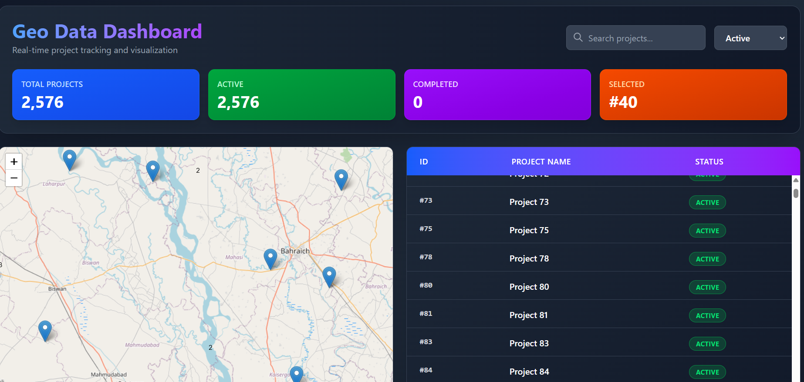

# Geo Data Dashboard

A React-based geo data dashboard that displays large datasets efficiently using a virtualized table and an interactive map. The application supports synchronized interaction between table rows and map markers, along with client-side filtering and sorting.

---

## 📂 Folder Structure

geo-project/
│
├── public/
│   └── index.html
│
├── src/
│   ├── api/
│   │   └── api.js
│   │   # Handles mock API calls & pagination logic
│   │
│   ├── assets/
│   │   ├── image1.png
│   │   ├── image2.png
│   │   ├── image3.png
│   │   ├── image4.png
│   │   └── image5.png
│   │   # Screenshots used in README
│   │
│   ├── components/
│   │   ├── MapView.jsx
│   │   │   # Leaflet map, markers & map interactions
│   │   └── TableView.jsx
│   │       # Virtualized data table with sorting & filtering
│   │
│   ├── data/
│   │   ├── data.js
│   │   └── mockData.js
│   │   # Static & mock dataset
│   │
│   ├── App.jsx
│   │   # Central state management & map-table synchronization
│   │
│   ├── main.jsx
│   │   # React entry point
│   │
│   ├── App.css
│   └── index.css
│
├── .gitignore
├── eslint.config.js
├── package.json
├── package-lock.json
├── vite.config.js
└── README.md

---

## 🧠 Design Decisions

### 1. State Management
- Used local state (`useState`) only
- Redux was avoided to keep the codebase simple and easy to understand
- Selection state is centralized in `App.jsx` to synchronize the table and map

### 2. Performance Optimization
- Implemented table virtualization using `@tanstack/react-virtual`
- Only visible rows are rendered, enabling smooth handling of 5,000+ rows
- Client-side sorting and filtering for faster UI response

### 3. Component Decomposition
- **MapView**: Handles map rendering, markers, and marker click events
- **TableView**: Manages table rendering, sorting, filtering, and row selection
- **App**: Acts as the orchestrator and shared state manager
- Clear separation between UI components and data logic

### 4. Map Integration
- Leaflet was chosen due to:
  - Lightweight footprint
  - Easy marker customization
  - Good performance with large datasets
- Clicking a table row highlights the corresponding map marker
- Clicking a map marker highlights the corresponding table row

### 5. Styling & UI
- Tailwind CSS used for fast and consistent styling
- Dark-themed UI for a professional dashboard appearance
- Responsive layout supporting different screen sizes

---

## 📸 Screenshots

---

## ⏱️ Time Spent

Approximately **8–10 hours**, including:
- UI layout and styling
- Table virtualization
- Map integration
- Map and table synchronization
- README documentation

---

## ✅ What This Project Demonstrates
- Clean and scalable component architecture
- Efficient handling of large datasets
- Proper usage of React hooks and functional components
- Real-world dashboard design patterns
